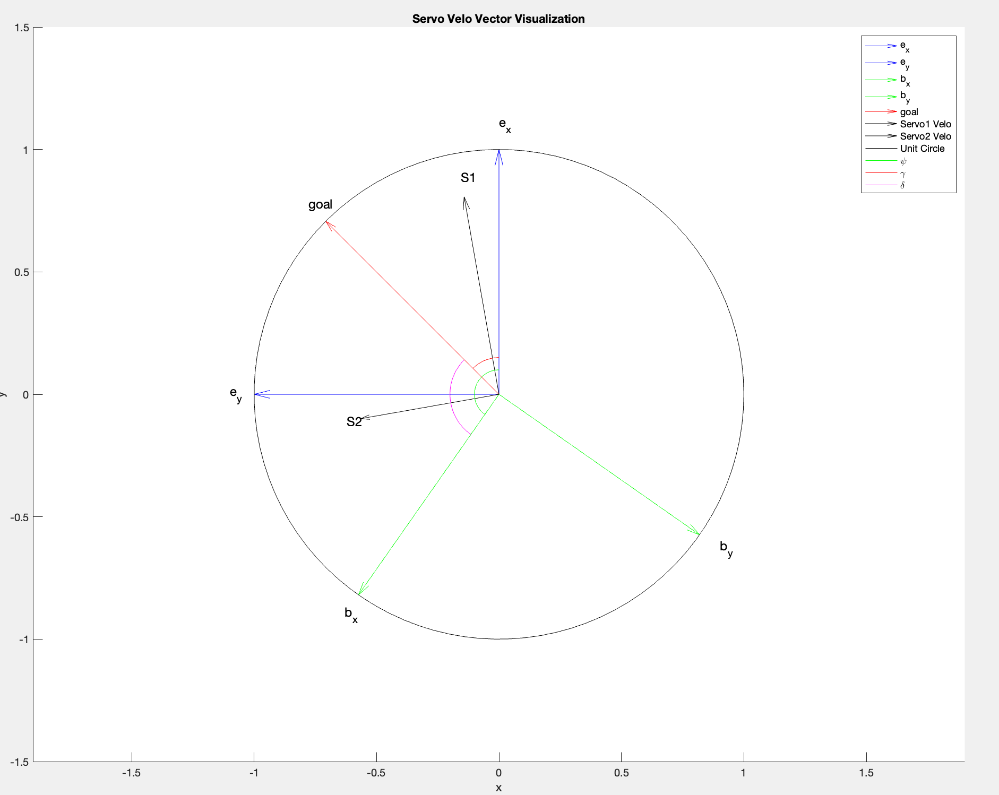

# Orientation

## Continous Servo Values

This goal of this section will be to devel into the finding values to send to the continous rotation servos on the UDM.
The servos take values from [0,180] where 90 is not moving, 0 is moving forward at full speed and 180 is moving backward at full speed. The servo angle is based on how far, delta, the body frame orientation is from the goal vector.

As shown above there we will be simplifying this analysis to 2 dimensions. The image above shows a top down view definition of the inertial and body frames. The angle between them is psi. The direction the UDM wants to move in is labeled goal and defined by the angle gamma. The difference between the goal and body frame is defined as delta.

The servos are offset from from the body by 45 degrees. This means that servo1 is constrained to the positive or negative direction along the line formed at psi + 45 degrees (servo1 offset). Similarly servo2 is constained to the positive or negative direction along the line formed at psi - 45 degrees (servo2 offset).

The values passed to the servo can thus be calculated as follows:

delta = gamma - phi

servo1_mag = cos(servo1_offset - delta)

servo2_mag = cos(servo2_offset - delta)
